# Toto Automation System - Implementation Summary

## 🎯 Latest Update: Single Button Navigation

**Issue Addressed**: After clicking "今すぐ投票予想する", the system now properly clicks the "シングル" button to navigate to the single voting page.

### ✅ What Was Implemented

1. **Enhanced Navigation Flow** - Added the missing step:
   ```
   Start Page → Detect Rounds → Select Round → Click "今すぐ投票予想する" → Click "シングル" → Single Voting Page
   ```

2. **New Functionality**:
   - `click_single_button()` method in `TotoRoundSelector`
   - Multiple selectors to find the シングル button reliably
   - Proper verification of navigation to single voting page
   - Enhanced error handling and logging

3. **GUI Integration**:
   - Added "Click Single" button for manual control
   - Updated "Auto Navigation" to include single button click
   - Updated status messages and user feedback

4. **Documentation Updates**:
   - Updated usage guide with new step
   - Enhanced automation flow descriptions
   - Added test script for validation

## 🔧 Technical Implementation

### TotoRoundSelector (`toto_round_selector.py`)

**New Method**: `click_single_button()`
```python
def click_single_button(self) -> bool:
    """Click the 'シングル' (Single) button to go to single voting page"""
```

**Enhanced Selectors**:
- `//img[@id='select_single']` - Primary selector
- `//img[@name='select_single']` - Name attribute
- `//img[@alt='シングル']` - Alt text
- `//img[contains(@src, 'bt_toto_single.gif')]` - Image source
- Multiple fallback selectors for reliability

**Updated Flow** in `navigate_to_voting_prediction()`:
- **Step 6**: Click 'シングル' button (NEW)
- Enhanced verification for single voting page URL
- Better error messages and logging

### GUI Integration (`enhanced_gui_automation.py`)

**New Button**: "Click Single"
- Located in navigation buttons frame
- Calls `click_single_button()` method
- Provides user feedback and error handling

**Enhanced Messages**:
- "Successfully navigated to single voting page!"
- Updated auto navigation descriptions
- Better status tracking

## 🎮 User Interface

### Manual Control Buttons (Left to Right):
1. **Detect** - Find available rounds
2. **Select** - Choose specific round
3. **Start Voting Prediction** - Click "今すぐ投票予想する"
4. **Click Single** - Click "シングル" (NEW)
5. **Auto Navigation** - Complete automatic flow

### One-Click Operation:
- **Complete Workflow** - Full automation including single button

## 🔄 Complete Automation Flow

```mermaid
graph TD
    A[Start Page] --> B[Detect Rounds]
    B --> C[Select Round]
    C --> D[Round Info Page]
    D --> E[Click 今すぐ投票予想する]
    E --> F[Click シングル] 
    F --> G[Single Voting Page]
    G --> H[Form Filling]
    H --> I[Cart Addition]
```



## 📊 Current System Capabilities

### ✅ Fully Implemented:
- **Complete Navigation**: All steps from start to single voting page
- **Round Detection**: Multiple patterns including PC/mobile specific
- **Form Filling**: 13 games × 10 sets batch processing
- **Cart Management**: Add to cart with confirmation handling
- **GUI Control**: Both manual and automatic operation modes
- **Error Handling**: Comprehensive retry logic and user feedback
- **Logging**: Detailed step-by-step progress tracking

### 🎯 System Flow:
1. **Navigation Phase**: ✅ Complete (including single button)
2. **Data Processing Phase**: ✅ Complete 
3. **Form Filling Phase**: ✅ Complete
4. **Cart Addition Phase**: ✅ Complete
5. **User Interface**: ✅ Complete

## 🚀 How to Use

### Quick Start (Recommended):
```bash
python3 enhanced_gui_automation.py
# 1. Select CSV file
# 2. Click "Complete Workflow"
# 3. Done! ✨
```

### Manual Control:
```bash
python3 enhanced_gui_automation.py
# 1. Select CSV file
# 2. Click "Auto Navigation" (includes single button)
# 3. Use form processing as needed
```

### Testing:
```bash
python3 test_single_button_navigation.py
# Tests the complete enhanced navigation flow
```

## 🏆 Key Features

### 🎯 Navigation System
- **Smart Round Detection**: Handles PC (`pcOnlyInline`) and mobile versions
- **Automatic Selection**: Selects latest round by default
- **Manual Override**: Users can select specific rounds
- **Complete Flow**: From start page to single voting page automatically

### 📝 Form Processing
- **Batch Processing**: Handles multiple betting sets efficiently
- **13-Game Support**: Full support for all 13 toto games
- **Value Mapping**: Proper CSV to form value conversion
- **Error Recovery**: Retry logic for failed operations

### 🛒 Cart Management
- **Smart Detection**: Multiple methods to find cart buttons
- **Dialog Handling**: Automatic confirmation dialogs
- **Navigation**: Return to voting page for next batch
- **Status Tracking**: Real-time progress updates

### 🖥️ User Interface
- **One-Click Operation**: Complete workflow in single button
- **Manual Control**: Step-by-step operation for debugging
- **Real-time Feedback**: Status updates and progress bars
- **Error Messages**: Clear user guidance for issues

## 🔍 Validation & Testing

### Test Coverage:
- ✅ Navigation flow with single button
- ✅ Individual button functionality
- ✅ Round detection and selection
- ✅ Form filling and cart addition
- ✅ Error handling and recovery
- ✅ GUI integration and feedback

### Quality Assurance:
- **Code Validation**: All components pass structural validation
- **Integration Testing**: End-to-end workflow testing
- **Error Handling**: Comprehensive exception management
- **User Experience**: Intuitive interface with clear feedback

## 📈 System Status: COMPLETE ✅

The toto automation system is now **fully functional** with:
- ✅ **Complete Navigation** (including single button step)
- ✅ **Robust Form Processing**
- ✅ **Reliable Cart Management** 
- ✅ **User-Friendly Interface**
- ✅ **Comprehensive Documentation**
- ✅ **Testing & Validation**

**Ready for production use!** 🎉